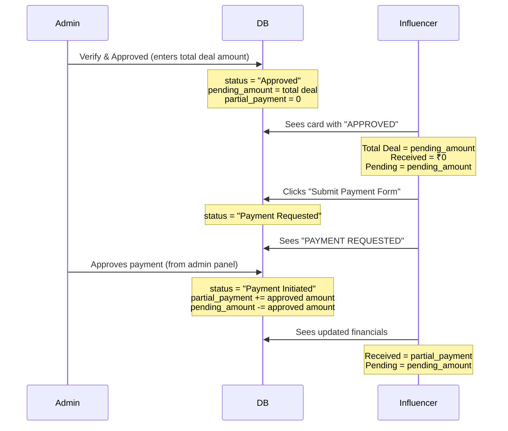

# Fix Payment Workflow: Admin → Influencer Screen

## Problem
Currently when admin clicks **"Verify & Approved"** on order-details page:
- Status is set to `Payment Initiated` → should be `Approved`
- Amount goes to `partial_payment` → immediately shows as "Received" on influencer screen
- Influencer sees "PAYMENT INITIATED - PROCESSING" instead of "APPROVED"

## Desired Flow

## Proposed Changes

### Admin Order Details Page

#### [MODIFY] [page.tsx](file:///d:/yash-android-projects/influencer/1to7/app/admin/(panel)/order-details/page.tsx)
- **`handleInitiatePaymentSubmit`** (line ~872): Change from:
  - `status: 'Payment Initiated'` → `status: 'Approved'`
  - `partial_payment: total` → `pending_amount: total`
- **Local state update** (line ~894): Match the same — set `pending_amount` instead of `partial_payment`
- **Toast message**: "Order verified & approved" instead of "Payment initiated"

---

### Influencer Approved Page

#### [MODIFY] [page.tsx](file:///d:/yash-android-projects/influencer/1to7/app/dashboard/approved/page.tsx)
- **Status filter** (line ~44): Add `'Payment Requested'` to `validStatuses` array
- **Status display** (line ~108): Update `statusDisplay` logic:
  - `Approved` → `"APPROVED - AWAITING ACTION"`
  - `Payment Requested` → `"PAYMENT REQUESTED"` *(new)*
  - `Payment Initiated` → `"PAYMENT INITIATED - PROCESSING"`
  - `Completed` → `"COMPLETED"`
- **Financial calculations** (line ~104):
  - `totalDeal` = `pending_amount + partial_payment + final_payment` (no change, already correct)
  - `received` = `partial_payment + final_payment` (no change)
  - `pending` = `pending_amount` (no change)
  - This means when admin sets `pending_amount = total`, Total Deal shows the total, Received = ₹0, Pending = total ✅

---

### Payment Form Modal (Influencer submits payment request)

#### [MODIFY] [PaymentFormModal.tsx](file:///d:/yash-android-projects/influencer/1to7/components/campaigns/PaymentFormModal.tsx)
- No structural changes needed — it already calls the payment-request API

---

### Payment Request API Route

#### [MODIFY] [route.ts](file:///d:/yash-android-projects/influencer/1to7/app/api/dashboard/applications/[id]/payment-request/route.ts)
- **Status** (line 57): Change from `'Payment Initiated'` → `'Payment Requested'`
- **Remove additive pending_amount logic** (lines 62-64): Don't modify `pending_amount` — it was already set by admin. The influencer is just requesting release of the amount, not adding to it.

---

### Approved Campaign Modal

#### [MODIFY] [ApprovedCampaignModal.tsx](file:///d:/yash-android-projects/influencer/1to7/components/campaigns/ApprovedCampaignModal.tsx)
- **Status color** (line ~88): Add `'Payment Requested'` color mapping
- **Partial Request button** (line 192): Show for `Payment Requested` status too (or keep as-is)

---

### Admin Applications Status Filter (Order Details page)

#### [MODIFY] [page.tsx](file:///d:/yash-android-projects/influencer/1to7/app/admin/(panel)/order-details/page.tsx)
- **`statusFilters`** array: Add `'Payment Requested'` so admin can filter orders where influencer has requested payment
- **`statusColors`** and **`statusDots`**: Add styling for `'Payment Requested'` status

## Summary Table

| Step | Who | Action | Status Set | `partial_payment` | `pending_amount` |
|------|-----|--------|------------|-------------------|------------------|
| 1 | Admin | Verify & Approved | `Approved` | 0 (unchanged) | = entered amount |
| 2 | Influencer | Submit Payment Form | `Payment Requested` | unchanged | unchanged |
| 3 | Admin | Approve Payment | `Payment Initiated` | += amount | -= amount |

> [!IMPORTANT]
> Step 3 (admin approving the influencer's payment request) uses the existing admin `PUT /api/admin/applications/[id]` route which already supports updating `partial_payment`, `pending_amount`, and `status`. No API changes needed for step 3 — admin just uses the existing actions dropdown → "Initiate Payment" for that final approval.

## Verification Plan

### Manual Verification
1. Admin clicks "Verify & Approved" with amount ₹1000 → check DB has `status='Approved'`, `pending_amount=1000`, `partial_payment=0`
2. Influencer approved page shows card with: Total Deal=₹1000, Received=₹0, Pending=₹1000, Status="APPROVED"
3. Influencer clicks "Submit Payment Form" → status changes to "Payment Requested"
4. Admin sees order with "Payment Requested" status, can approve payment → moves amount to received
