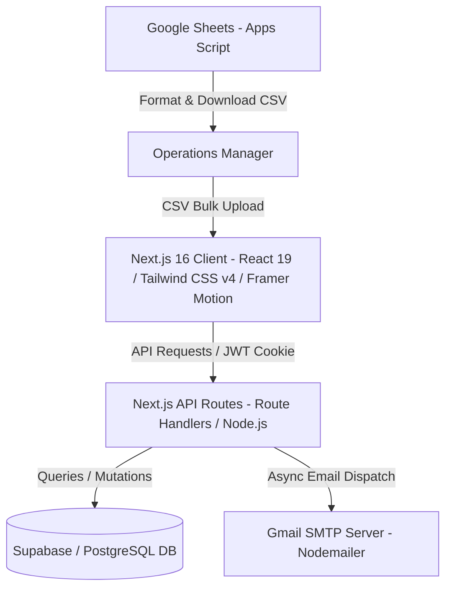
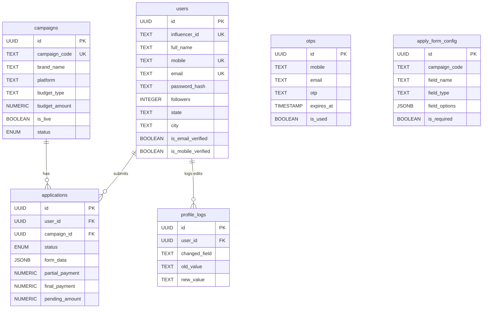

# 1to7 Media: Influencer Platform Interview Preparation Guide

This guide is designed to help you confidently present the **1to7 Media Platform** in technical interviews and frame it effectively on your resume. 

---

## 📄 Part 1: High-Impact Resume Bullet Points
Use these bullet points in your resume under your **Projects** or **Work Experience** section. They are written using the **STAR method** (Situation, Task, Action, Result) and contain critical keywords that trigger ATS (Applicant Tracking System) matches.

* **Full-Stack Web Development**: "Designed and developed **1to7 Media**, a high-performance creator campaign collaboration platform built with **Next.js 16 (App Router)**, **React 19**, **TypeScript**, and **Supabase (PostgreSQL)**, facilitating seamless partnerships between influencers and top brands."
* **Frictionless Application Flow**: "Architected and implemented a high-conversion **Guest Checkout Application Flow** that checks mobile registration on-the-fly and automatically registers creators with hashed passwords and secure **JWT-based sessions** in a single API call, reducing application drop-off rates."
* **Advanced Multi-Identifier Authentication**: "Engineered a flexible custom authentication system allowing creators to log in using their **Email, Mobile Number, or Custom Sequential Creator ID (HYxxxxx)**. Integrated secure password hashing via `bcryptjs` and session tokens stored in secure, `httpOnly` cookies to protect against XSS and CSRF attacks."
* **Robust Concurrency Handling**: "Created a sequential Creator ID generator using a **hybrid concurrency-resolution strategy** in Node.js (with an offset check-and-retry loop) and an atomic PostgreSQL PL/pgSQL database sequence update, preventing race conditions under high-traffic spikes."
* **Dynamic Form Builder & API Integrations**: "Developed a dynamic campaign form loading service that fetches custom fields from Supabase based on campaign configurations and supports image uploading. Automated asynchronous confirmation emails using **Nodemailer** over SMTP without blocking client-side server responses."
* **Operational Sheet Bridge**: "Programmed a **Google Apps Script** integration that allows operational managers to format, validate, and convert Google Sheets rosters directly into database-ready CSV files, streamlining bulk influencer and payment import in the admin dashboard."

---

## 🏛️ Part 2: Core Architecture & Tech Stack Overview
If an interviewer asks, *"Tell me about the architecture of this project,"* you should structure your answer as follows:

### 1. The Technology Stack
* **Frontend**: **Next.js 16** (utilizing the App Router for nested layouts and Server-Side Rendering capabilities), **React 19** (taking advantage of modern rendering features), **TypeScript** (for type-safety), and **Tailwind CSS v4** (for advanced styling).
* **Animations & Icons**: **Framer Motion** for premium transitions/modals and **Lucide React** for modern UI icons.
* **Backend**: Next.js API Route Handlers (running on Node.js runtime).
* **Database**: **Supabase** acting as a hosted PostgreSQL database.
* **Auth & Security**: **Jose** (for signing/verifying JWTs) and **Bcryptjs** (for password hashing).
* **External Integrations**: **Nodemailer** for automated email alerts and **Google Apps Script** for Excel/Google Sheets data syncing.

### 2. File Organization
* **[`/app`](file:///d:/yash-android-projects/influencer/1to7/app)**: Contains routes and pages. Client pages (`/dashboard`, `/login`, `/signup`, `/admin`) and API routes (`/api/auth`, `/api/campaigns`, `/api/apply`, `/api/admin`).
* **[`/components`](file:///d:/yash-android-projects/influencer/1to7/components)**: Reusable React components.
  * `campaigns/`: `CampaignCard` (visual animations), `CampaignDetailModal` (details modal), `ApplicationFormModal` (multi-step guest application).
  * `providers/`: `AuthProvider` (manages global login/logout state and caches credentials locally).
  * `ui/`: Custom buttons, inputs, dialogs (Shadcn/Radix-based).
* **[`/lib`](file:///d:/yash-android-projects/influencer/1to7/lib)**: Server and database utilities.
  * `auth.ts` / `admin-auth.ts`: JWT signing, verification, and cookie decrypt.
  * `user-utils.ts`: Creator ID generator.
  * `mailer.ts`: SMTP email templates and transport logic.
  * `supabase.ts` / `supabase-client.ts`: Supabase client initialization.

---

## 🗄️ Part 3: Database Schema & Relationships
You must understand how the database tables are related. Here is a relational diagram of the tables defined in [`supabase/schema.sql`](file:///d:/yash-android-projects/influencer/1to7/supabase/schema.sql):

### Critical Database Optimizations
* **Composite Index**: A unique composite index is defined on `applications(user_id, campaign_id)`. This enforces the business rule that **an influencer can only apply to a campaign once**.
* **Partial Indexes**: Custom partial indexes are created on `otps` (e.g., `CREATE INDEX idx_otps_mobile_unexpired ON public.otps(mobile, expires_at) WHERE (is_used = false AND mobile IS NOT NULL)`). This optimizes OTP lookups by skipping expired or already-used OTP codes.
* **Flexible Fields**: The `applications` table utilizes a **`JSONB` data type** for the `form_data` column. This allows the application to save dynamic inputs (e.g. Instagram Link, Shipping Address) without altering the database schema for different campaigns.

---

## ⚡ Part 4: Key System Walkthroughs
Interviewers love details about *how* you built specific systems. Be ready to explain these three systems in depth:

### 1. Frictionless Guest Application Flow
* **How it works**: Instead of forcing users to sign up *before* looking at campaigns, influencers click "Apply". 
* **The Steps**:
  1. The user enters their 10-digit mobile number.
  2. The system invokes `/api/auth/check-mobile`.
  3. If the user already exists, they enter an email challenge flow to confirm identity.
  4. If the user is new, they fill in basic profile details + dynamic campaign answers.
  5. The API `/api/apply` creates their account in the background (with a hashed placeholder password), saves the campaign application, generates their unique `influencer_id`, signs a secure **JWT cookie** (auto-logging them in), and triggers an automated welcome email.
* **Why it's a great talking point**: It demonstrates your focus on **UX design** and **product metrics** (minimizing drop-offs in the acquisition funnel).

### 2. Concurrency Control in Sequential ID Generation
* **The Challenge**: Influencer IDs must follow a clean sequential prefix format: `HY10000`, `HY10001`, etc. If multiple users sign up simultaneously, there is a risk that both reads will fetch the same "latest" number, causing database collisions.
* **The Solution**: You implemented a dual-fail-safe mechanism:
  * **App-level loop (with exponential backoff/offset)**: In [`lib/user-utils.ts`](file:///d:/yash-android-projects/influencer/1to7/lib/user-utils.ts), a retry loop runs up to 5 times. If a collision is suspected or retried, it offsets the index (`attempts` added to the ID), checks uniqueness in the DB, and commits.
  * **Database-level atomic sequence (Transactional)**: The schema contains a table `influencer_id_counter` and a function `generate_influencer_id()`. The function uses a PostgreSQL `UPDATE ... RETURNING` query, which automatically places a row-level write lock on the counter row, guaranteeing that concurrent database requests receive unique numbers sequentially.

### 3. Google Sheets Integration Bridge
* **The Challenge**: Operations teams and brand managers love using spreadsheets to track pay lists and rosters, but importing them manually is error-prone.
* **The Solution**: A Google Apps Script (`google_apps_script.js`) runs inside the sheet.
  * It maps and validates custom spreadsheet columns (Name, Phone, Instagram link) to database-compatible fields (`full_name`, `mobile`, `instagram_username`).
  * It extracts clean Instagram usernames from full URLs (via regular expressions).
  * It automatically hashes passwords and generates a CSV download.
  * In the Admin Panel, the CSV is parsed on-the-fly and processed in batches via a Next.js API, updating existing creators and creating new accounts in bulk.

---

## ❓ Part 5: Top 10 Technical Interview Q&As

### Q1: Why did you choose custom JWT cookies over Supabase's built-in Auth?
**Answer**: 
> "While Supabase Auth is excellent, building custom JWT authentication using the `jose` library gave us absolute control over the onboarding flow. It enabled us to support multi-identifier logins (creators can log in using Email, Mobile, or their custom Influencer ID) easily. Additionally, it allowed us to write custom guest checkout logic where we auto-generate user profiles and set secure, `httpOnly` cookies in a single POST request without forcing the client through a complex, multi-step OAuth or Supabase signup transaction."

### Q2: How did you protect user sessions and data from client-side attacks (XSS/CSRF)?
**Answer**: 
> "We store our JWT session tokens in `httpOnly` cookies. The `httpOnly` flag prevents client-side JavaScript from accessing the cookie, which mitigates Cross-Site Scripting (XSS) token theft. We also enforce the `secure` flag in production (ensuring cookies are only sent over HTTPS) and use `sameSite: 'lax'` to prevent Cross-Site Request Forgery (CSRF) on cross-origin link clicks."

### Q3: How do you handle email delivery in Next.js without slowing down the HTTP response?
**Answer**: 
> "In API endpoints like `/api/apply`, sending an email via SMTP using Nodemailer can take 1–2 seconds due to network handshakes. To prevent this from blocking the response, we initiate the email transfer as a detached promise using `Promise.resolve(sendEmail(...)).catch(...)` without using the `await` keyword before returning the `NextResponse`. This fires the email asynchronous task in the background and immediately responds to the user, ensuring a snappy UI experience."

### Q4: How does the application handle dynamic forms? What if a brand wants custom fields?
**Answer**: 
> "We designed a table called `apply_form_config` linked to campaign codes. When a creator opens a campaign, the frontend queries this configuration. We dynamically render input elements (checkboxes, text inputs, dropdowns) based on the field definitions. When the user submits, we store their answers in a PostgreSQL `JSONB` column inside the `applications` table. This allows us to support arbitrary forms per campaign without executing database migrations."

### Q5: How do you optimize dashboard stats queries to avoid database overhead?
**Answer**: 
> "Instead of running slow SQL queries that pull full records or running five separate sequential queries, we run them in parallel using Javascript's `Promise.all()`. Furthermore, we instruct the Supabase client to perform index-only head queries by passing `{ count: 'exact', head: true }`. This returns only the count metadata instead of the actual row records, keeping database network payload close to zero."

### Q6: What is the benefit of Tailwind CSS v4 in this application?
**Answer**: 
> "Tailwind CSS v4 introduces a completely redesigned compiler that is significantly faster. It handles theme customization directly inside CSS files using standard CSS variables rather than requiring a large JavaScript configuration file (`tailwind.config.js`). It also natively integrates with modern PostCSS tools, resulting in smaller production CSS builds."

### Q7: If two users submit an application for the same campaign, how does the database handle duplicates?
**Answer**: 
> "We have a unique constraint on the database table `applications`: `UNIQUE(user_id, campaign_id)`. If duplicate requests bypass the client checks and hit the database simultaneously, the database rejects the second insert with a unique constraint violation error code `23505`. Our API catches this specific error code and returns a clean `409 Conflict` message to the user."

### Q8: How did you implement real-time profile progress completion?
**Answer**: 
> "In the `AuthProvider`, we created a helper function `getMissingFields()`. It iterates through a predefined checklist of required profile details—including bank account info, location, and social handles—and checks if they are empty. We use the length of this missing fields list to compute a profile strength score and conditionally show warning badges to remind users to complete their setups before applying to high-payout campaigns."

### Q9: How do you handle file uploads for campaign deliverables or screenshots?
**Answer**: 
> "We validate files on the client-side first—restricting uploads to JPG, PNG, and WebP, and enforcing a 5MB size limit. The file is sent to the `/api/upload` endpoint, which securely uploads the file to a Supabase Storage bucket, returns a signed public URL, and saves that URL path inside the campaign application's JSONB form data."

### Q10: How does your Google Sheets Apps Script process social media links?
**Answer**: 
> "When managing lists, managers paste full Instagram links (e.g. `https://instagram.com/creator_handle?igsh=...`). Our Apps Script uses a regular expression: `instaIdRaw.match(/instagram\.com\/([^/?]+)/)` to extract the raw username handle (`creator_handle`), strip query parameters, validate it, and export a cleaned profile format. This prevents messy link formats from entering our database."
